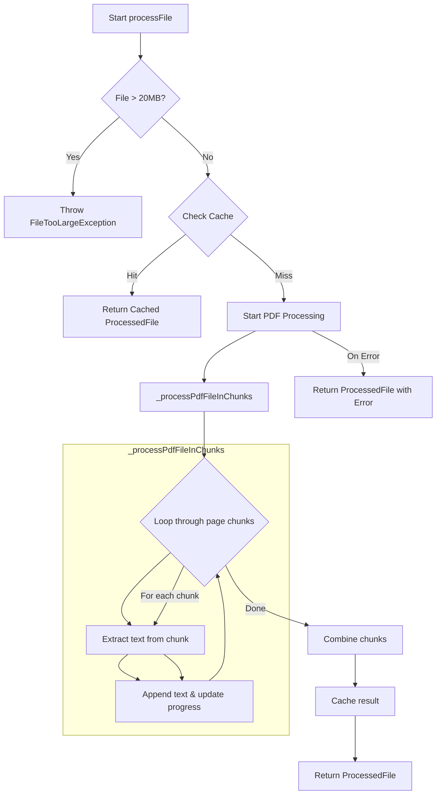

# Plan to Improve Large PDF Handling

The current implementation processes the entire PDF file in memory, which is inefficient for large files and can lead to crashes. This plan refactors the process to be more memory-efficient, resilient, and to provide clear feedback to the user.

## 1. Implement Chunked PDF Processing

The `lib/services/file_content_processor.dart` will be modified to process PDFs in smaller chunks rather than all at once. This will significantly reduce memory usage.

**PDF Processing Flow Diagram:**



This diagram illustrates how the file will be processed in manageable pieces, preventing the application from being overwhelmed.

## 2. Introduce Progress Reporting and Cancellation

To improve user experience, `lib/providers/chat_provider.dart` will be updated to manage and display the progress of file processing.

**Chat Provider Flow Diagram:**

```mermaid
graph TD
    A[sendMessage called] --> B{Files attached?};
    B -- No --> G[Send message to Ollama];
    B -- Yes --> C[Start FileContentProcessor.processFiles];
    C --> D{Listen to Progress Stream};
    D --> E[Update UI with progress (e.g., 'Processing PDF 25%')];
    D -- On Error --> F[Show Error to User];
    D -- On Completion --> G;
    G --> H[Get AI Response];
    H --> I[Display Response];
```

This flow ensures the user is kept informed about the background activity and can cancel it if needed.

## 3. Enhanced Error Handling

Error handling will be improved so that if PDF processing fails, the user is shown a clear error message in the UI, and the faulty context is not sent to the AI model.

## Summary of Steps:

1.  **Refactor `FileContentProcessor`**: Introduce chunking to the PDF text extraction logic to handle large files without consuming excessive memory.
2.  **Add Progress Reporting**: Implement a progress stream from the `FileContentProcessor` to the `ChatProvider` to provide real-time feedback.
3.  **Update `ChatProvider`**: Modify the provider to manage the file processing state, including progress and the ability to cancel the operation.
4.  **Improve UI Feedback (Proposed)**: The UI should display the progress of the file processing and provide a cancellation option. Errors will be displayed directly to the user.